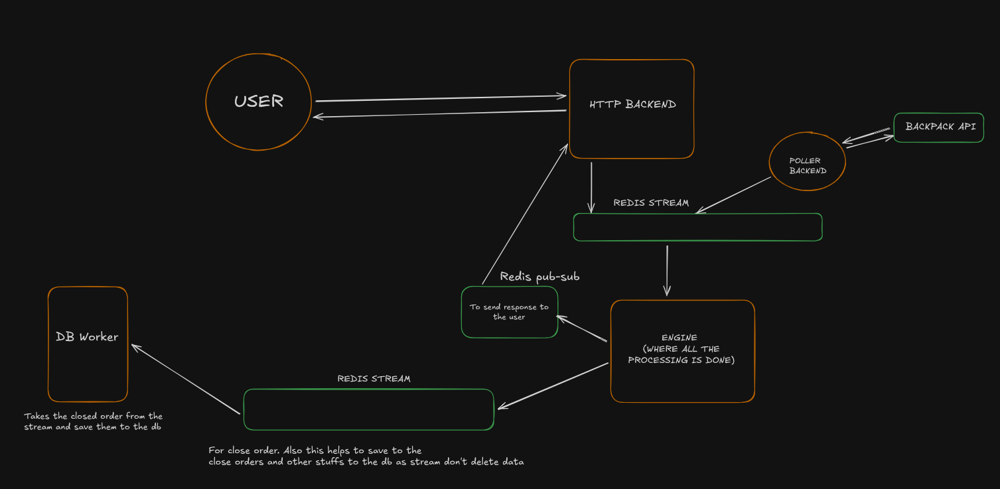

# Delta - An Option Trading Platform

**Live Demo:** [delta.samadesh.com](https://delta.samadesh.com)

**Delta** is a high-performance, microservices-based option trading platform designed for speed, scalability, and reliability. It features a real-time matching engine, live market data streaming, and a responsive React frontend.



## System Architecture

Delta uses an event-driven microservices architecture to handle high-frequency trading operations efficiently.

### The Flow

1.  **Client Request**
    - The user places an order via the **FrontendClient**.
    - The request hits the **HTTP Server** (behind Nginx/Docker Proxy).

2.  **Order Queuing**
    - The **HTTP Server** validates the request and pushes it to a **Redis Stream** (`trade`).
    - Instead of blocking, the HTTP server subscribes to a specific response channel and waits.

3.  **Order Processing (The Engine)**
    - The **Engine** (in-memory) polls the `trade` stream.
    - It matches orders, updates balances, and manages positions in microseconds.
    - **Market Data**: The **Poller** service continuously feeds live prices from **Backpack Exchange** into the Engine via Redis.
    - **Liquidation**: If prices move against a user, the Engine auto-liquidates positions within 3-5 seconds.

4.  **Response & Feedback**
    - Once processed, the Engine publishes the result back to **Redis Pub/Sub**.
    - The **HTTP Server** picks up the result and sends the final response to the user.
    - Simultaneously, the Engine broadcasts updates to the **Frontend** via WebSockets (through the Poller/HTTP layer).

5.  **Persistence (DB Worker)**
    - To keep the Engine fast, it *never* writes to the database directly.
    - It pushes completed trades to the `engine-response` stream.
    - The **DB Worker** asynchronously reads this stream and saves data to **PostgreSQL**.

### Why Microservices?

- **Independent Scaling**: We can scale the **HTTP Server** to handle millions of connections without touching the **Engine**.
- **Performance**: The **Engine** remains single-threaded and lock-free (in-memory), unburdened by slow database writes.
- **Reliability**: If the **DB Worker** crashes, the Engine keeps running. Data piles up in Redis and is processed once the worker restarts.

---

## Services Overview

| Service | Technology | Role | Documentation |
| :--- | :--- | :--- | :--- |
| **Frontend** | React, Vite, Zustand | User Interface, Charts & Trading Panel | [Read More](./frontend/README.md) |
| **HTTP API** | Express, Bun | REST API, Auth, Request Gateway | [Read More](./http/README.md) |
| **Engine** | Node/Bun | Order Matching, Risk Management | [Read More](./engine/README.md) |
| **Poller** | Node/Bun, WS | Market Data Aggregator | [Read More](./poller/README.md) |
| **DB Worker** | Prisma, Bun | Async Database Writer | [Read More](./db-worker/README.md) |

---

## Project Setup

### Prerequisites
- [Docker & Docker Compose](https://www.docker.com/)
- [Bun](https://bun.sh/) (for local development)

### Quick Start (Local)

1. **Clone the repository:**
   ```bash
   git clone https://github.com/SamadeshPoudel/Option-Trading-Platform.git
   cd Option-Trading-Platform
   ```

2. **Setup Environment Variables:**
   Copy `.env.example` to `.env` in the root and each service directory.
   ```bash
   cp .env.example .env
   # Repeat for frontend/, http/, engine/, etc.
   ```

3. **Start Infrastructure (Redis & Postgres):**
   ```bash
   docker compose up -d redis db
   ```

4. **Run Services:**
   You can run services individually using `bun run index.ts` in their respective directories, or use Docker Compose to spin up the whole stack:
   ```bash
   docker compose up --build
   ```

5. **Access the Platform:**
   - Frontend: `http://localhost:5173`
   - Backend API: `http://localhost:5000`

---

## Tech Stack

- **Frontend**: React 19, TypeScript, TailwindCSS v4, Lightweight Charts
- **Backend API**: Node.js/Bun, Express, Better-Auth
- **Core Engine**: In-Memory Typescript Engine
- **Database**: PostgreSQL (Prisma ORM)
- **Message Broker**: Redis Streams & Pub/Sub
- **DevOps**: Docker, Docker Compose, Nginx

---
